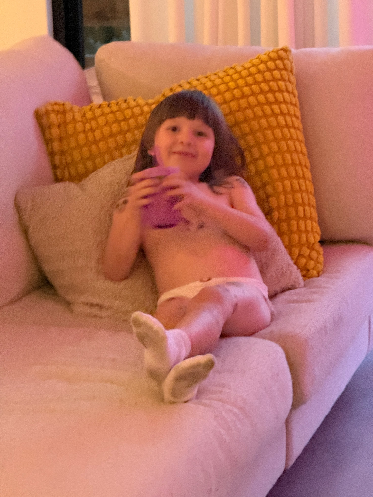
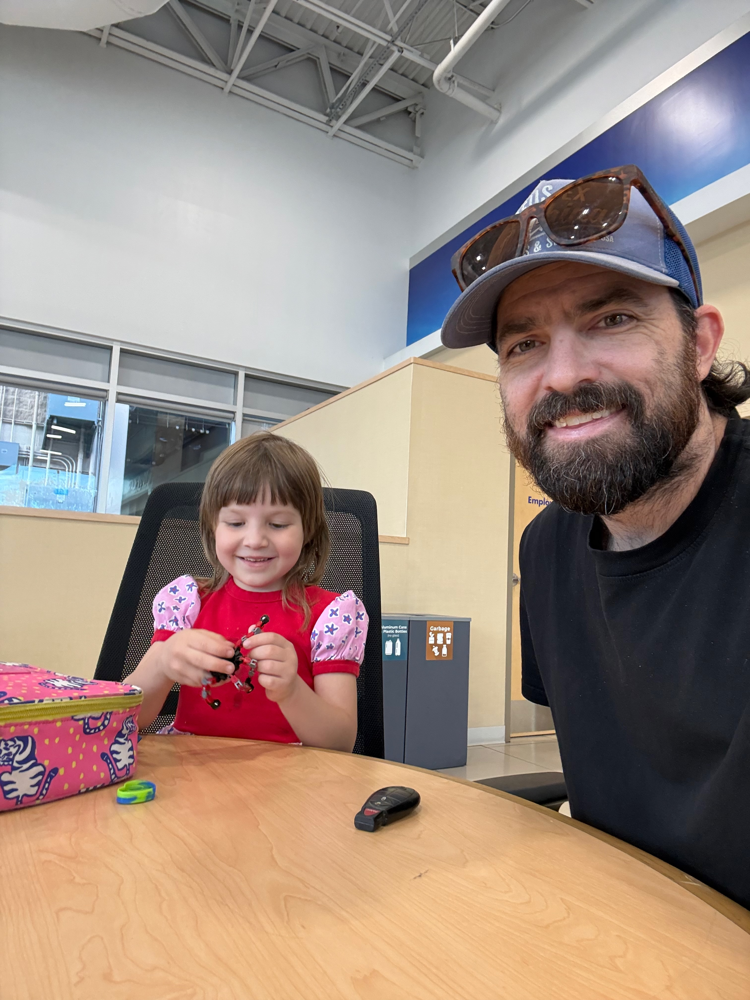
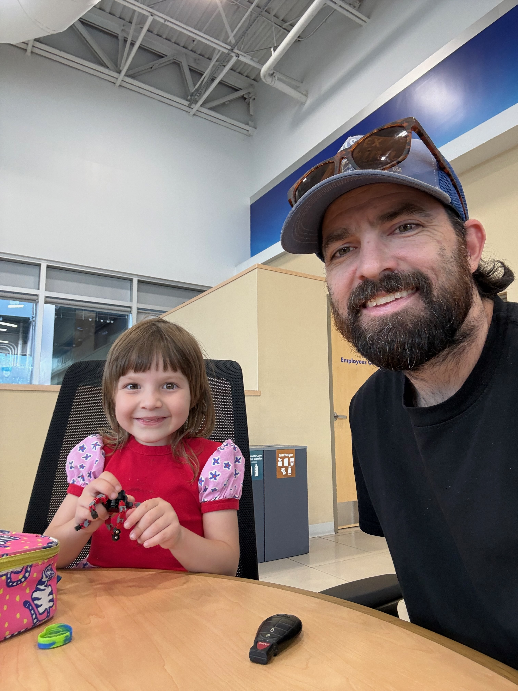
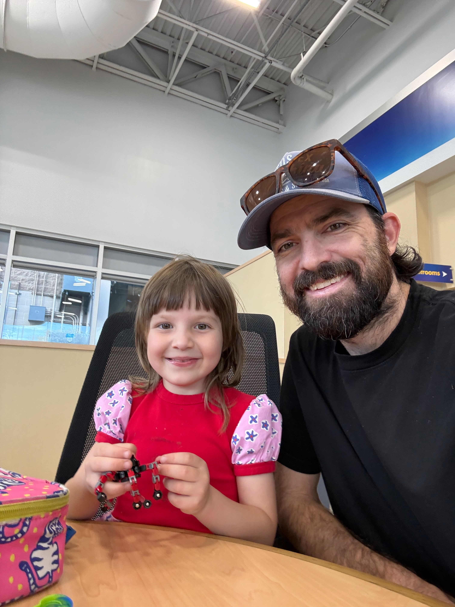
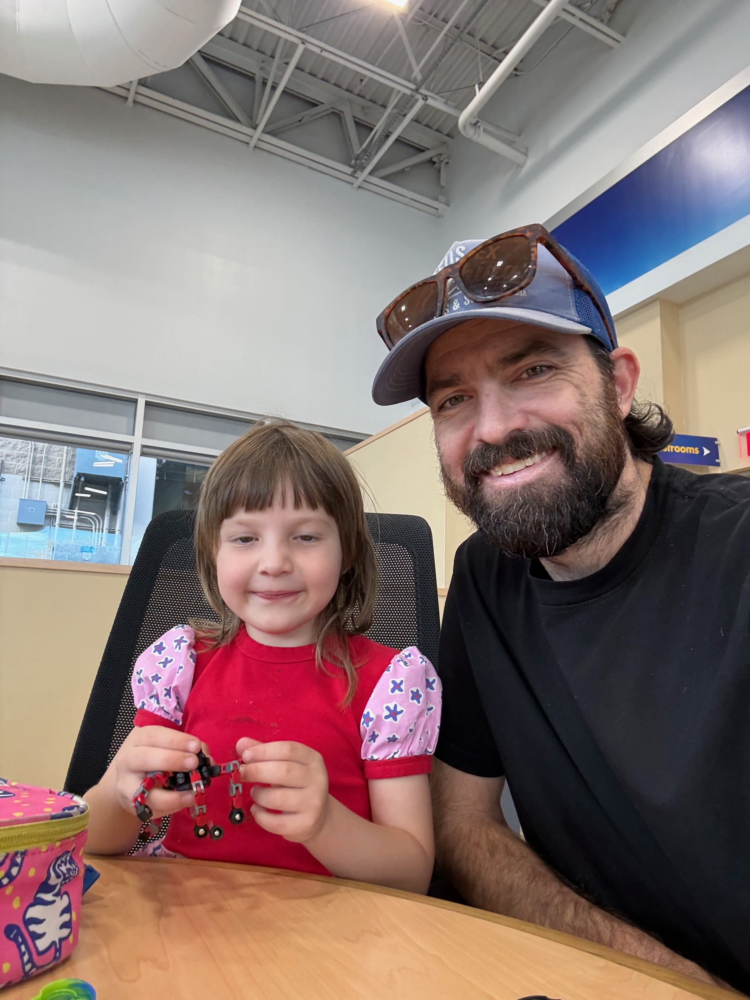

# The Adventures of Kit and Dad: Master Builders

## Chapter 1: The Mysterious Red Blocks

It was a perfectly ordinary day at Dad's office when Kit discovered something extraordinary. While lounging on the cozy couch with her favorite purple cup, she spotted a colorful box that seemed to be calling her name.

"Dad!" she exclaimed, her eyes sparkling with curiosity. "What's in that box?"

## Chapter 2: The Master Plan

Soon, Kit found herself in Dad's big office chair, feeling very important indeed. Dad, wearing his signature trucker hat and sporting his magnificent beard, pulled up a chair beside her. Together, they opened the mysterious box to reveal... BUILDING BLOCKS!

"We're going to build something amazing," Dad announced with a grin. Kit nodded seriously - this was important business.

## Chapter 3: The Construction Zone

With determined focus, Kit picked up the red and black pieces. Her little fingers worked carefully, connecting each block with the precision of a seasoned engineer. Dad watched proudly as his co-architect got to work.

"Is this how you build robots, Dad?" Kit asked, concentrating intensely on her creation.

## Chapter 4: The Building Continues

Block by block, their masterpiece took shape. Kit's face lit up with each successful connection, her infectious smile filling the office with joy. Dad couldn't help but beam with pride at his little builder's enthusiasm.

"Look Dad, it's getting taller!" Kit announced triumphantly.

## Chapter 5: The Masterpiece Complete

With teamwork and determination, Kit and Dad created something wonderful together. More than just blocks assembled, they built memories, laughter, and the kind of father-daughter bond that makes the best adventures.

And so concludes another successful day in the office, where the most important work isn't done on computers or in meetings, but in the precious moments shared between a dad and his brilliant little builder, Kit.

---

*"The best projects are the ones you build together."* - Kit & Dad

## About This Project

This story and photo collection was created using AIVA's Photos integration, which provides seamless macOS Photos app automation through the Model Context Protocol (MCP). The photos were automatically exported using AI-powered tools that can search, select, and export photos from your personal library.

### Story Creation Process:
- ✅ Automated photo export from macOS Photos
- ✅ AI-powered story generation from visual content  
- ✅ Markdown document creation with embedded images
- ✅ Git repository initialization and documentation

A perfect example of how AI can help transform your personal memories into meaningful stories and shareable content.