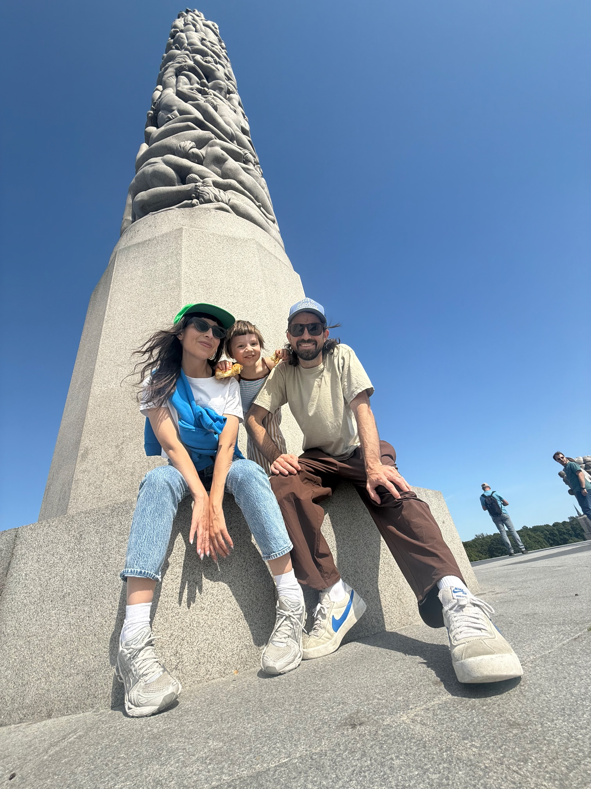
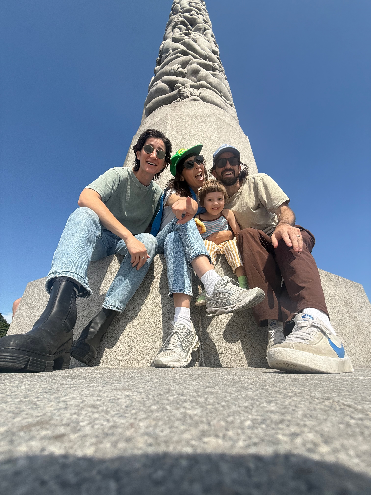
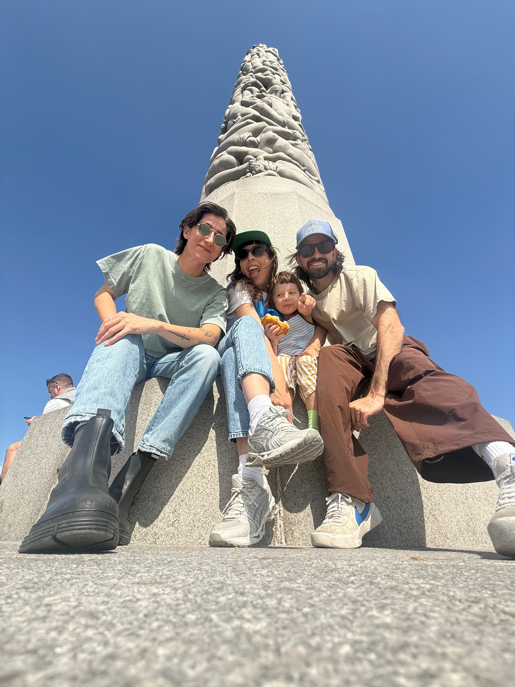
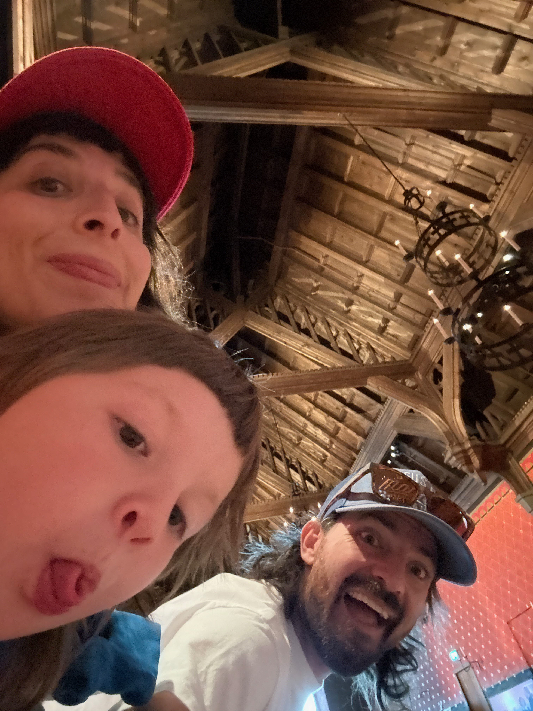
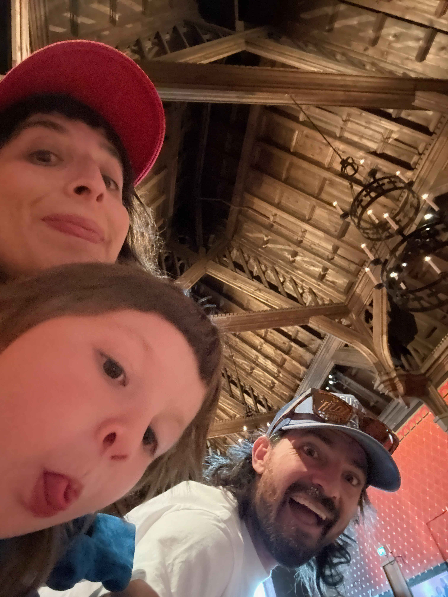
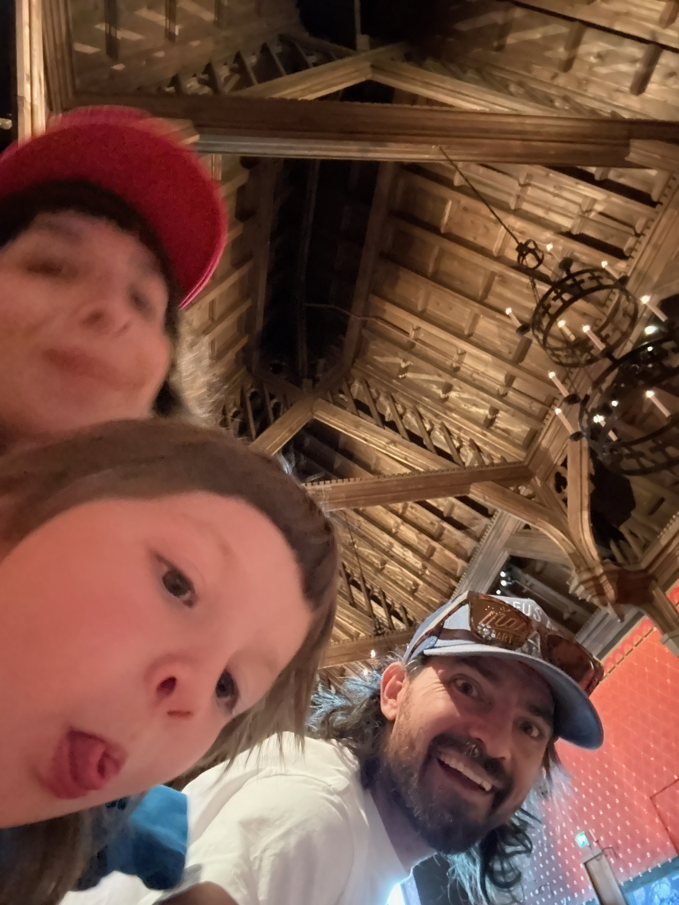
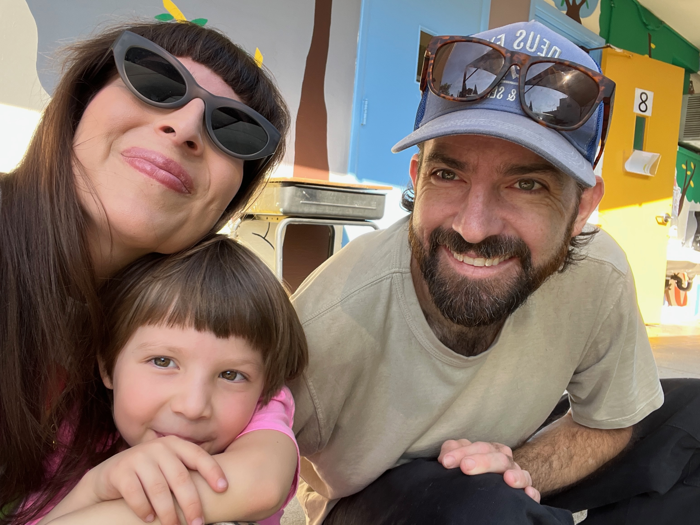
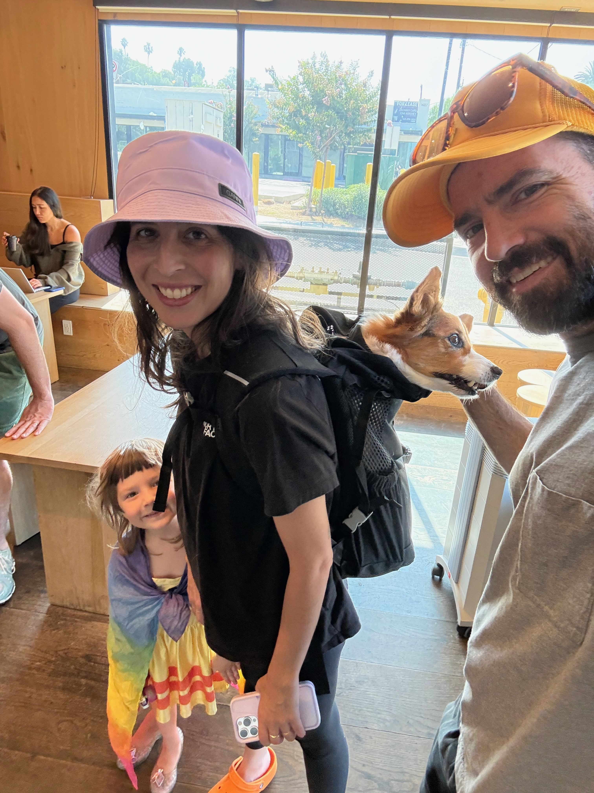
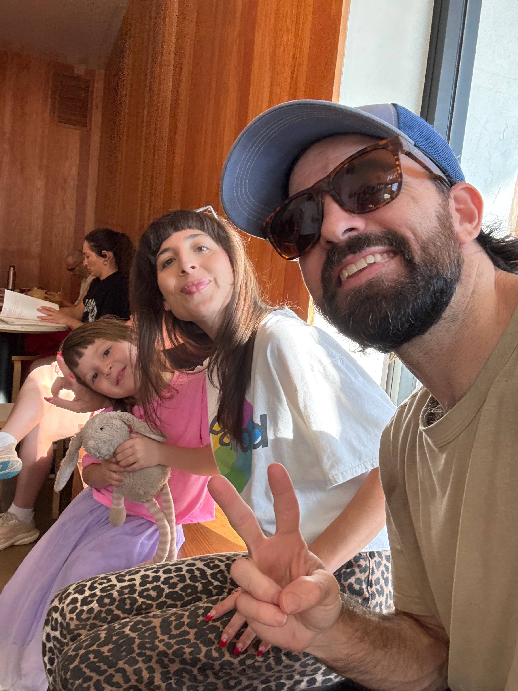

# Kit's International Adventure: From Oslo to Los Angeles

A photo story documenting Kit's travels with Mike and Rachel from the historic landmarks of Oslo, Norway to the sunny cafes of Los Angeles, California.

## Chapter 1: Family Monument Moments in Frogner Park
*June 13, 2025 - Oslo, Norway*

The adventure begins at one of Oslo's most iconic locations - Frogner Park, home to Gustav Vigeland's incredible sculpture installation. Against the backdrop of the towering monolith with its intertwined human figures reaching skyward, Kit, Rachel, and Mike create their own perfect family moment.

The clear blue Norwegian sky provides the perfect setting as they sit together at the base of the granite monument. Kit, nestled between her parents, beams with joy while Rachel sports a vibrant green cap and Mike relaxes in his casual earth-tone outfit. The contrast between the ancient-feeling sculptural art and this modern family moment creates something truly special.

Multiple shots capture different perspectives of this magical moment - each one revealing new details about their Norwegian adventure. The warmth in their expressions stands out against the cool stone of the monument, showing how travel brings families together in the most beautiful ways.

## Chapter 2: Historic Fortress Fun  
*June 14, 2025 - Akershus Fortress, Oslo*

The next day brings the family to Akershus Fortress, a medieval castle and fortress that has watched over Oslo for over 700 years. But history becomes fun when Kit's around! 

Rachel's striking red hat adds a pop of color to the ancient stone architecture as the family takes playful selfies in what appears to be the fortress's historic interior. The Gothic arches and stonework create a dramatic backdrop for their silly faces and genuine laughter.

Kit's natural comedian instincts shine through as she makes faces for the camera, while Mike captures the moment with his characteristic big smile. These aren't just tourist photos - they're glimpses into how a family can find joy and connection anywhere, even in the most serious historical settings.

The medieval walls have seen centuries of history, but today they witness something equally precious - a young family creating memories that will last their own lifetime.

## Chapter 3: California Adventures
*August 18-25, 2025 - Los Angeles, California*

Two months later, the adventure continues back on home turf in sunny California. At what appears to be a local cafe or family-friendly restaurant, the trio settles in for some quality time together. Kit's playful energy is as bright as ever, and Mike's joy in being with his family shines through his smile.

The warm California light streaming through the windows creates a completely different mood from their Norwegian adventure - but the love and connection between them remains constant no matter where in the world they are.

*Located at 1503 W Sunset Blvd, Los Angeles*

The Los Angeles adventure continues with Rachel carrying what appears to be an adorable Corgi puppy while Kit beams with excitement nearby. Mike documents this sweet moment - perhaps they're visiting friends, or maybe this little furry friend is a new addition to their adventures!

The casual LA vibe with its bright windows and modern interior contrasts beautifully with the ancient stones of Oslo, showing how this family adapts and finds joy wherever their travels take them.

Back to more family moments in what looks like another cozy California spot. Kit continues to be the star of the show with her infectious energy, while Mike and Rachel capture these precious everyday moments that are just as meaningful as any international landmark.

## The Journey Continues

From the artistic monuments of Oslo's Frogner Park to the historic walls of Akershus Fortress, and finally to the sunny cafes of Los Angeles - Kit's adventure showcases how family travels create the most treasured memories. Each location brought new experiences, but the constant thread throughout is the love, laughter, and genuine connection between Kit, Mike, and Rachel.

Whether posing by ancient Norwegian sculptures or enjoying a casual moment in a California cafe, this family knows how to find magic in every moment of their journey together.

---

*Story created from photos exported via the complete workflow: from Photos app search to GitHub repository, capturing memories and transforming them into lasting narratives.*